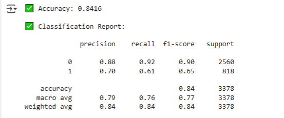
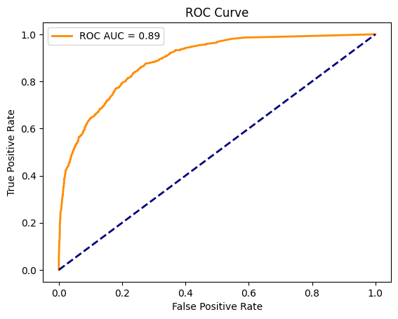
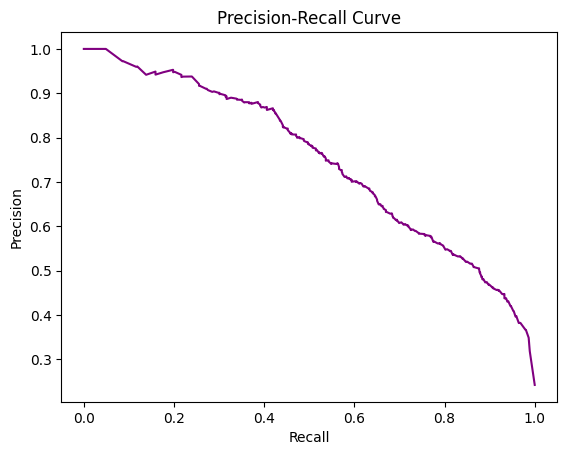

# employee-salary-prediction
A machine learning project to predict employee income categories using Python and Random Forest
Built using: Python, Pandas, Scikit-learn, Matplotlib, Seaborn

## 📊 Model Output & Evaluation

### ✅ Classification Report & Accuracy
* Accuracy: 83.6%
* Precision, Recall, F1-score shown below.

---

### 🧮 Confusion Matrix

---

### 📈 ROC Curve

---

### 📊 Feature Importance

---

### 📉 Precision-Recall Curve

